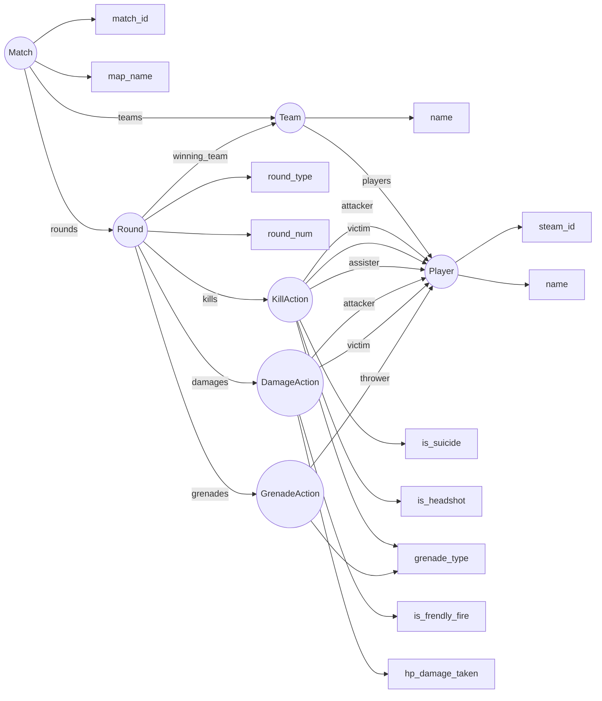

# Классы в CS.py
## Match
Класс Match описывает собственно матч. Хранит данные о matchID, mapName, а также список команд teams и список раундов rounds

## Team
Описывает команду. Содержит название команды name и список игроков players

## Round
Описывает раунд. Содержит тип раунда (разминка, первая половина, вторая половина, мб овертайм - примеров не видел), номер раунда, убийства в этом раунде как список объектов Kill, аналогично нанесенный урон и брошенные гранаты. Также сожержит название команды, победившей в этом раунде

## Player
Описывает игрока. Содержит как поля класса только steamID и username. Остальное думаю будет как вычисляемые свойства через матч, так как явного представления о всех игроках в json нет

## KillAction
Описывает событие убийства: кто, кого, с чьей помощью, был ли огонь по своим, суисайд и был ли хэдшот

## DamageAction
Аналогично KillAction, кто, кого и как больно, а также был ли урон по своим

## GrenadeAction
Аналогично. Кто кинул и что кинул. Потом имеет смысл доработать тип гранаты до какого-нибудь enum, надо подумать

# Диаграма
